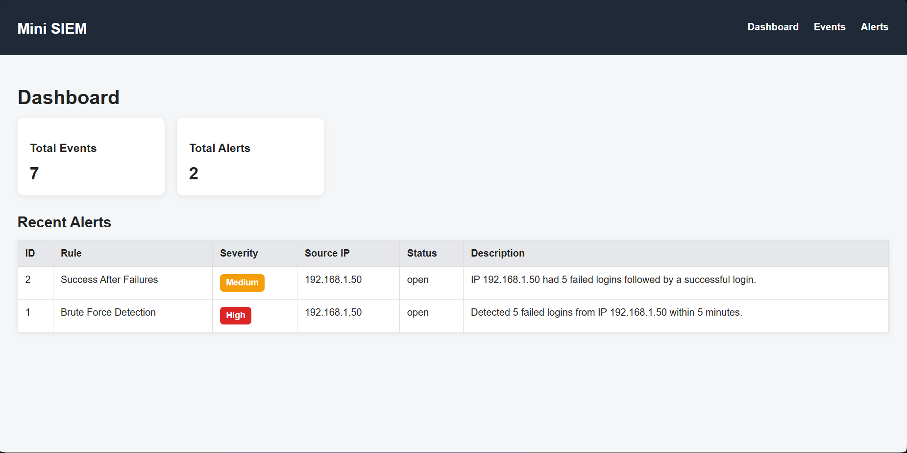

# Mini SIEM (Windows-focused)

A lightweight SIEM-style application that ingests Windows security events (JSON lines), normalizes them into structured events, runs detection rules, and displays alerts/events in a FastAPI dashboard.

## Features
- Log ingestion from `logs/windows_events.log` (JSONL format)
- Event normalization + storage (SQLite + SQLAlchemy)
- Detection rules:
  - Brute Force Detection (multiple failed logins within a time window)
  - Success After Failures (success following repeated failures)
- Duplicate prevention for events and alerts
- Web dashboard:
  - Dashboard summary (event/alert counts + recent alerts)
  - Events view + filters (event_type, source_ip, username)
  - Alerts view + filters (severity, source_ip, status)
- CSV export (planned)
- Log integrity verification with hashes (planned)

## Tech Stack
- Python
- FastAPI + Jinja2 templates
- SQLite + SQLAlchemy

## Screenshots


## Project Structure
```text
app/        # FastAPI app, models, detection rules, parsers
scripts/    # ingestion/detection utilities
logs/       # sample Windows events (JSONL)
